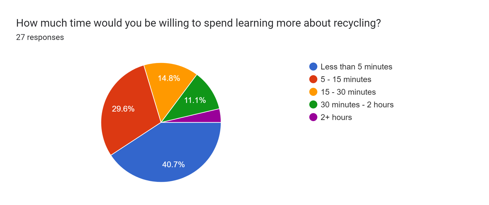

# Project Milestone: User Research and Implications for Design

**Team 11:**
- Adithya Gutala
- Hector Magallanes Lua
- Marx John Pena
- Ron Elijah Rivera
- Sakar Pokhrel
- Syed Faiz

## Problem Description

Currently, improper recycling practices lead to the rejection of much of the material received by recycling plants since it's not in a proper state. For example, when recyclable food containers are tossed away mixed with food scraps (Figure 1). As such, the recycling infrastructure is not working to its full capacity.

Figure 1. Soiled food containers.

We need to take care of our home, and recycling is a big part of it. Without recycling, landfills can fill up faster, greenhouse gases will increase, and our natural resources can become polluted. Prior to designing and conducting research, we considered the following to be the main attributes of our problem:

- Lack of formal education on proper recycling methods and their importance.
- Indifference toward the environment.
- Societal conventions that encourage overconsumption and lead to excessive waste.
- Lack of infrastructure to encourage recycling.

While our research problem focuses on recycling and the implications of a society that doesn't know how to properly recycle, the broader problem we can eventually address is how to better care for the environment in general by using the findings of our research.

## User Research Process

### Who were our participants, and how were we reached out to them:

Since recycling is something the general population is involved in to some degree, our research participants were people from different backgrounds. Each of the team members reached out to fellow students, family members, friends, and acquaintances in order to obtain data from diverse sources.

### User Research Method: Survey

We were interested in collecting as much data as possible, and the nature of our problem made it a simple choice to design a survey that would allow us to collect details about our participants' experiences with recycling.

The survey should not take more than 15 minutes and will include multiple-choice and open-ended questions for users to share their experience. The goal is to identify the common ground and patterns in their experiences about recycling. It could be patterns of their knowledge, influences, and habits to understand the problem we're resolving. Additionally, identifying these common patterns will help us come up with ideas or solutions that will help develop our product.

### Survey Details

For a total of 10 questions, the survey consisted of 8 multiple-choice questions and 2 essay-type questions.

## Data Analysis Process

### What did you do to analyze the data?

**Quantitative data analysis:** We looked at the summary of our survey answers (like the pie charts in the pictures below) and drew conclusions based on the data.

This was the first question in the survey, and it helped us begin to recognize the theme of convenience being key to people's motivations while recycling.

Again, this summary reinforced our finding that most of the population just doesn't want to put in much effort into recycling or learning to recycle better since it's inconvenient.

**Qualitative data analysis:** For the two essay-based questions, we were able to apply some of the analysis techniques discussed in class for gathering codes and themes from an interview transcript. We grouped and categorized the answers to both questions and exported them to our Miro board so we could visualize them better.

Codes and themes extracted from the question "What do you think would make recycling easier for others?"

Codes and themes extracted from the question "What do you think would motivate others to learn proper recycling practices?"

### What did you find? What was interesting? What was expected?

Before analyzing survey results, we expected to see the following reasons as reasons for a lack of recycling:
- Insufficient education on how to properly recycle and their importance.
- Indifference toward the environment.
- Societal conventions that encourage overconsumption and lead to excessive waste.
- Lack of infrastructure to encourage recycling.

After analyzing survey results, we found out that:
- Most participants don't lack knowledge about recycling. They only recycle when it is easy or convenient.
- Most participants stated they would only be interested in spending 5 minutes at the most studying about recycling.

Last but not the least, here are few ways that could help get more people to recycle:
- Incentivize recycling.
- Create more awareness through campaigns and dedicated classes about recycling.
- Show data on the impacted areas.
- Reminder about long-term benefits.
- Improve and raise awareness about recycling infrastructure.

### How does this finding inform what you can design?

With the use of an app, we can spread information that most participants did not understand. A lot of our users only know you can recycle soda, plastic bottles, and glass bottles, but not so much about electronics or how to properly prepare them too. Most of the time, a lot of people do not separate colored plastic from clear plastic and the different colored glasses if you were to take them to recycle centers. Participants (not of the survey but people we randomly asked) did not know you even get paid at recycle centers for properly disposing recycles. The use of an app can teach those who want to learn on their own. Since most participants also learned to recycle from family and friends. This could cause a ripple effect of friends teaching others how to properly recycle as well, making a more positive feedback for the use. Although the issue is well known and addressed, most do not do it since they do not think they make an impact, so if we can also leave a result every month or season that shows some significant result, it gives more incentive to continue to recycle. We can even make a community chat within the app for communities who also would like to track their results as a whole.

## Next Steps: Design

### Briefly describe the direction you will move forward in designing.

Ideally, we want the app to have positive feedback on the community. Have videos to teach you what can be recycled and what cannot. Therefore, you can segregate your recycle to be properly disposed of, whether that is in the recycling bin near your house or a recycling center. Possible features could be those videos, location of recycle centers near you, forms of communication for communities, current prices of the recyclable objects, and maybe forms of service for those who are willing to put minimal effort but not all the effort.

## Conclusion:

In conclusion, we selected recycling and its awareness as our main topic. Our goal is to study the knowledge everyone possesses about recycling as far as how to properly recycle, and what items can and can't be recycled. In general, to get a grasp on where the society stands in terms of their awareness. To research and study this, we prepared a 10 questions short survey that we used and reached out to students, family, friends, and acquaintances. The findings of the search were interesting. A significant portion of participants admitted to only recycling when it was convenient for them and are only willing to spend less than 5 minutes to learn about recycling. The bigger problem here was not lack of knowledge or awareness but laziness, not following proper steps to recycle, hence convenience is a major deal for most participants. To circumvent convenience, the best way would be to raise awareness about recycling centers nearby, the items they accept, and how they pay for recycling items. Additionally, prepare short skits such as YouTube shorts, ads, TikTok, or Instagram campaigns promoting recycling.

# Milestone 2: Iterating on your Prototypes: Heuristic Evaluation

The goals of this milestone:

1. Individually: Take at least two passes (first to get a feeling for the flow and scope of the system, then to focus on evaluation). Focus on generating as many problems as you can, don't rank severity yet.
2. Combine all problems together (by all team members).
3. Individually determine how severe each problem is (from 0–4).
4. As a group, discuss and aggregate problems and come to a consensus on severity ratings. Discuss the changes to be made to the prototype.
5. Make the changes and submit an iterated version.

## Evaluations:

### ●

○ Problem: There is no indication of which section of the app the user is on. This screenshot is of the homepage but it's visually unclear.
○ Who came up with the problem: Hector
○ Heuristics: #1 Visibility of System Status
○ Severity: 2
○ Proposed Changes: In the bottom menu, highlight the icon corresponding to the section of the app the user is currently on.
○ Screenshot with change:

### ●

○ Problem: When a user searches for how to recycle a certain item, there is no page to show search results or recommendations if the user's search yields no results.
○ Who came up with the problem: Hector
○ Heuristics: #3 User control and freedom, #5 Error Prevention
○ Severity: 3
○ Proposed Changes: Add an intermediary page to show search results and recommendations.
○ Screenshot with change:

### ●

○ Problem: The search results page is too plain. Each search result could contain a little more information for the user.
○ Who came up with the problem: Hector
○ Heuristics: #2 Match between system and real-world, #8 aesthetic and minimalist design
○ Severity: 2
○ Proposed Changes: Improve the UI, create card components for each search result with images.
○ Screenshot with change:

○ Problem:

### ●

● **Problem:** Inconsistent color scheme within pages. For instance, other pages on the app have a background color of light green. Here we have two pages in strong blue. Additionally, the text on the survey page is in white not providing contrast.
● **Who came up with the problem:** Syed
● **Heuristics:** #4 Consistency
● **Severity:** 3
● **Proposed Changes:** Change the color to light green to all pages to make it consistent and align with the same color scheme. Change the survey label color to black for contrast and better visibility.
**● Screenshot with change:**

Problem 5: 

● Problem: Under the importance of recycling, the contents are articles but the user does not know.
● Who came up with the problem: Syed
● Heuristics: #10 Help and Documentation
● Severity: 3
● Proposed Changes: Add below the article title in a smaller font “3 mins read”. It tells users it is an article and it is a short read to align with research survey results; users want to spend less than 5 minutes learning about recycling.
● Screenshot with change:

Problem 6:

● Problem: Once the article is open there is no emergency exit for the user to go back.
● Who came up with the problem: Syed
● Heuristics: #3 User in Control
● Severity: 4
● Proposed Changes: Add an emergency exit or back button on the top left corner with contrast for the user to identify and exit once desired.
● Screenshot with change:

**○ Problem:** fun fact is too dry and does not seem “fun”
**○ Who came up with the problem:** Ron
**○ Heuristics:** #8 aesthetic and minimalist design
**○ Severity:** 3
**○ Proposed Changes:** Make it more graphic and have pictures to make it “fun”
**○ Screenshot with change:** *still working on it*

**Problem:** Not enough color contrast on the News page

**Problem author:** Adithya

**Heuristic:** #8 Aesthetic and minimalist design

**Severity** : 2

**Proposed changes:** add more color contrast and animations to improve UI

**Screenshot with changes:** In Progress

